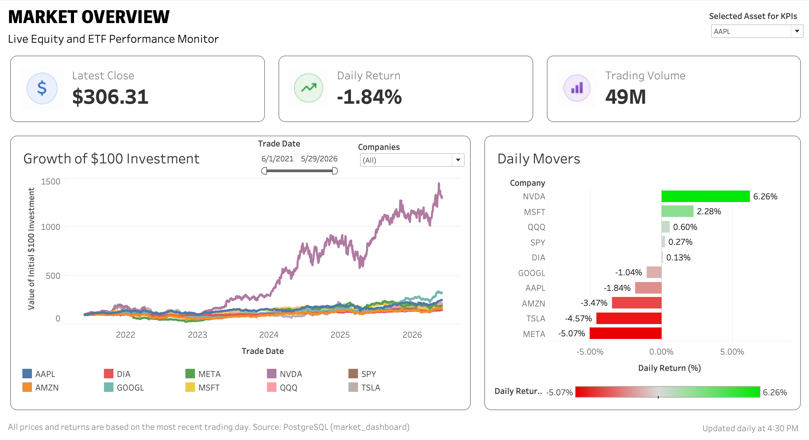

# Automated Market Dashboard Pipeline

An end-to-end financial market analytics project built with **Python**, **PostgreSQL**, and **Tableau**. The pipeline automatically downloads daily market data, updates a relational database, and powers an interactive Tableau dashboard through a live database connection.

## Dashboard Preview



## Project Overview

This project tracks the daily performance of a selected group of major stocks and market ETFs:

* AAPL
* AMZN
* DIA
* GOOGL
* META
* MSFT
* NVDA
* QQQ
* SPY
* TSLA

The dashboard provides an interactive overview of recent market activity, including:

* Latest closing price
* Daily return
* Trading volume
* Growth of a hypothetical $100 investment
* Daily movers ranked by percentage return
* Interactive asset selection
* Company comparison filters
* Adjustable date range

## Data Pipeline

```text
yfinance API
      ↓
Python update script
      ↓
PostgreSQL database
      ↓
Tableau live connection
      ↓
Interactive market dashboard
```

The Python script downloads recent open, high, low, close, and volume data for each tracked asset. It then inserts or updates the records in PostgreSQL using an upsert process, preventing duplicate ticker-date entries.

The updater is scheduled through macOS `launchd` to run automatically each day after market close.

## Tools and Technologies

* **Python**: automated data extraction and database updates
* **yfinance**: daily market-data retrieval
* **PostgreSQL**: relational database storage
* **SQL**: table creation, validation queries, and data inspection
* **Tableau**: interactive dashboard design and visualization
* **macOS launchd**: scheduled daily pipeline execution

## Database Structure

The PostgreSQL table stores one row per ticker and trading date.

| Column        | Description          |
| ------------- | -------------------- |
| `ticker`      | Stock or ETF symbol  |
| `trade_date`  | Market trading date  |
| `open_price`  | Opening price        |
| `high_price`  | Daily high           |
| `low_price`   | Daily low            |
| `close_price` | Closing price        |
| `volume`      | Daily trading volume |

The composite primary key is:

```sql
PRIMARY KEY (ticker, trade_date)
```

## Repository Structure

```text
market-dashboard-pipeline/
├── README.md
├── Market_Overview.png
├── requirements.txt
├── .gitignore
├── launchd/
│   └── com.example.marketdashboard.update.plist
├── scripts/
│   └── update_market_data.py
└── sql/
    └── create_stock_prices_table.sql
```
## How to Run

1. Install dependencies:

   ```bash
   python3 -m pip install -r requirements.txt
   ```
   
2. Create the PostgreSQL table:

   ```bash
   psql -d market_dashboard -f sql/create_stock_prices_table.sql
   ```
   
3. Run the updater:

   ```bash
   python3 scripts/update_market_data.py
   ```
   
4. Connect Tableau to the PostgreSQL stock_prices table using a live connection:
   
## Key Skills Demonstrated

* Building an automated ETL-style data pipeline
* Connecting Python to PostgreSQL
* Writing SQL queries and relational database logic
* Preventing duplicate records through upserts
* Scheduling unattended data updates
* Creating interactive Tableau dashboards
* Designing a portfolio-ready analytics product

## Future Improvements

Potential extensions include:

* Adding year-to-date return and volatility metrics
* Comparing selected assets against benchmark ETFs
* Adding a trading-volume trend chart
* Publishing the dashboard online
* Moving the database to a cloud-hosted PostgreSQL service

## Disclaimer

This project is intended for educational and portfolio purposes only. It is not intended to provide financial advice.
